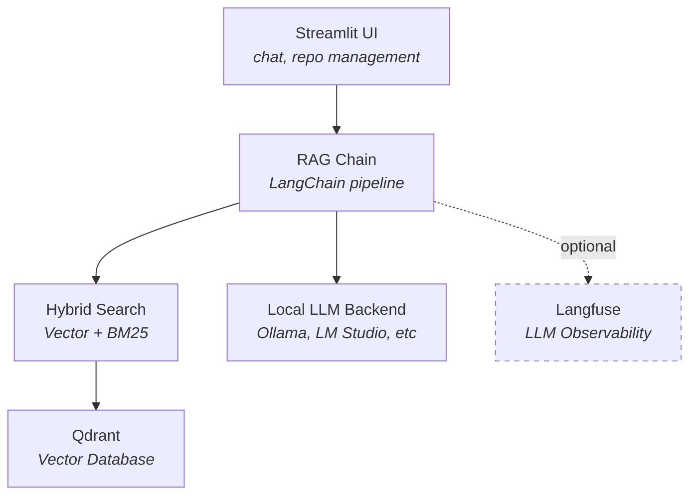

<p align="center">
  
</p>

<h1 align="center">Codebase RAG</h1>

<p align="center">
  <strong>Ask questions about any codebase. Runs entirely on your machine.</strong><br>
  Built with LangChain · Qdrant · Local LLMs · Streamlit
</p>

<p align="center">
  <a href="https://github.com/aschiltmansnavara/codebase-rag/actions/workflows/ci.yml"></a>
  
  <a href="https://www.python.org/downloads/"></a>
  <a href="https://github.com/astral-sh/ruff"></a>
  <a href="LICENSE"></a>
</p>

## Why This Project?

- **Fully local.** Runs entirely on your machine. Your code never leaves your hardware.
- **Hybrid retrieval.** Dense vector search + BM25 keyword search. The eval framework runs the same test set through hybrid, vector-only, and BM25-only retrieval, so the combination's effect on recall is measured rather than assumed. See the [retrieval ablation](evals/ablation.md).
- **Evaluated, not just vibes.** Ships with a reproducible evaluation framework (16 questions, two model sizes, detailed metrics). See [Evaluation Results](docs/evaluation-results.md).
- **Observable.** Optional Langfuse integration traces every retrieval and generation step, so you can debug quality issues instead of guessing.
- **Documented decisions.** Architecture Decision Records explain *why* each technology was chosen, not just *what* was used. See the [ADR index](docs/adr-index.md).
- **Batteries included.** `make services-start` gives you the app, vector DB, LLM server, and tracing dashboard. No manual setup.

## Features

**Retrieval Design**
- **Hybrid search.** Vector similarity and BM25 results merged with Reciprocal Rank Fusion (weighted 0.7/0.3), so ranking depends on each retriever's rank order rather than raw score magnitudes.
- **Language-aware chunking.** Naively splitting code by token count breaks at arbitrary lines, destroying context. Python-specific and Markdown-aware splitting preserves logical code units (functions, classes, sections).
- **Source citations.** Every answer includes the source files and repositories it drew from, so answers are verifiable.

**Infrastructure Choices**
- **Fully local stack.** Ollama, LM Studio, llama.cpp, vLLM, or Jan for inference; Qdrant for vectors; SQLite for chat history. No external API calls, no data egress.
- **Multi-repo ingestion.** Clone and index any public GitHub repository from the UI or CLI.
- **Idempotent ingestion.** Content hashing and deterministic chunk IDs prevent duplicates on re-ingestion, safe to run repeatedly in scheduled jobs or CI.

**Developer Experience**
- **Local LLM inference.** Choose your backend: Ollama, LM Studio, llama.cpp, vLLM, or Jan. Supports any model these platforms can run.
- **Conversation memory.** Multi-turn conversations with persistent SQLite-backed chat history.
- **LLM observability.** Optional Langfuse integration for tracing retrieval and generation with per-span metrics.

## Architecture



**Data flow:**

1. **Ingest.** `GitLoader` clones a repo → `DocumentProcessor` splits files into chunks using language-specific strategies → chunks are embedded with `sentence-transformers/all-mpnet-base-v2` and stored in Qdrant, with a parallel BM25 index built for keyword search.
2. **Retrieve.** User query hits the `HybridRetriever`, which merges vector and BM25 results, re-ranks, and returns the top-k documents above a relevance threshold.
3. **Generate.** Retrieved documents are formatted into a context prompt and sent to the configured LLM backend (Ollama, LM Studio, llama.cpp, vLLM, or Jan). The `RAGChain` handles conversation memory, prompt construction, and Langfuse tracing.
4. **Persist.** Chat history is stored in SQLite. Vector data lives in Qdrant. Both survive container restarts via Docker volumes.

## Project Structure

```
codebase-rag/
├── src/codebase_rag/
│   ├── app/              # Streamlit UI (main.py, components.py)
│   ├── config.py         # Environment-based configuration (singleton)
│   ├── data_ingestion/   # Git cloning, document processing, chunking
│   ├── database/         # Qdrant store, SQLite chat storage, embeddings
│   ├── llm/              # Ollama client, RAG chain with Langfuse tracing
│   └── retrieval/        # Vector search, BM25 search, hybrid retriever
├── Makefile              # Development task runner (make help)
├── scripts/
│   └── ingest.py         # Repository ingestion pipeline (single and multi-repo)
├── docker/
│   ├── compose-dev.yml   # Full-stack Docker Compose
│   ├── Dockerfile        # App container (Python 3.12)
│   └── entrypoint.sh     # Auto-ingest + model pull on first boot
├── evals/                # Evaluation framework and results
├── tests/                # Unit, integration, e2e, performance tests
└── docs/                 # ADRs and design documentation
```

## Getting Started

Quick start: `make services-start` → open http://localhost:8501.

See the [setup guide](docs/getting-started.md) for Docker and local installation, repository ingestion, and example queries.

## Configuration

All settings are configured via environment variables or `.env`. See the full [configuration reference](docs/configuration.md).

### LLM Backends

By default, the app uses Ollama for inference. To use a different backend, set `LLM_PROVIDER`:

**Ollama** (default)
```bash
LLM_PROVIDER=ollama
OLLAMA_BASE_URL=http://localhost:11434
```

**LM Studio**
```bash
LLM_PROVIDER=openai-compat
LLM_BASE_URL=http://localhost:1234/v1
# LLM_API_KEY is optional
```

**llama.cpp server**
```bash
LLM_PROVIDER=openai-compat
LLM_BASE_URL=http://localhost:8000/v1
```

**vLLM**
```bash
LLM_PROVIDER=openai-compat
LLM_BASE_URL=http://localhost:8000/v1
LLM_API_KEY=token-abc123  # if authentication is enabled
```

**Jan**
```bash
LLM_PROVIDER=openai-compat
LLM_BASE_URL=http://localhost:1337/v1
```

All OpenAI-compatible backends use the same interface, so you can switch between them by just changing `LLM_BASE_URL`.

## Command-Line Interface

Use `codebase-rag` to query and explore codebases from shell scripts, git hooks, and CI pipelines. All output goes to stdout (clean for piping), while diagnostics go to stderr.

### Query Command

Search for code snippets:

```bash
codebase-rag query "where is error handling implemented?"
```

Output in compact format (path, score, snippet):

```
src/app/handlers.py (0.95)
def handle_error(error):
    logger.error("Error occurred: %s", error)
    return {"status": "error", "message": str(error)}
```

Output as JSON for programmatic use:

```bash
codebase-rag query "retry logic" --format json | jq '.[] | .path'
```

Limit results and filter by repository:

```bash
codebase-rag query "database query" --k 3 --repo my-repo
```

### Ask Command

Get a full natural-language answer grounded in the codebase:

```bash
codebase-rag ask "explain the ingestion pipeline"
```

### Piping into LLM CLIs

Compose codebase retrieval with other tools. Example with `claude-cli`:

```bash
codebase-rag query "where is authentication?" | claude "Explain this code and suggest security improvements"
```

### Using in Shell Scripts and Hooks

Pre-commit hook that checks for debugging statements:

```bash
codebase-rag query "debugger" --format compact | grep -q pdb && echo "Debugger found!"
```

Git hook to add context to commit messages. Exit code 2 means "no results", not
a failure, so a `set -e` hook has to tolerate it explicitly or it aborts the
commit on the common case of a query that legitimately matches nothing:

```bash
context=$(codebase-rag query "$(cat /tmp/commit-msg)" --k 2 --format compact) || [ $? -eq 2 ]
if [ -n "$context" ]; then
    echo -e "\nContext:\n$context" >> /tmp/commit-msg
fi
```

## Development

The `Makefile` is the primary development interface. Run `make help` for the full list.

## License

This project is licensed under MIT. See the [LICENSE](LICENSE) file for details.
