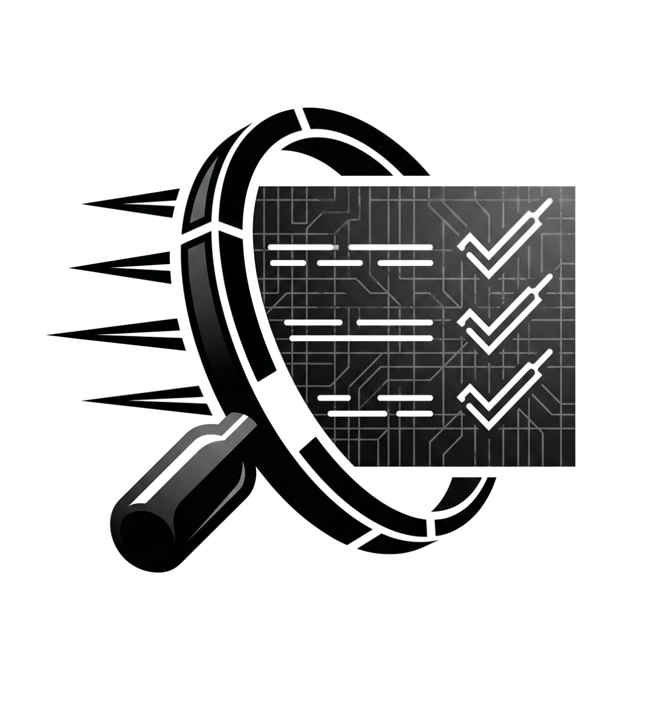
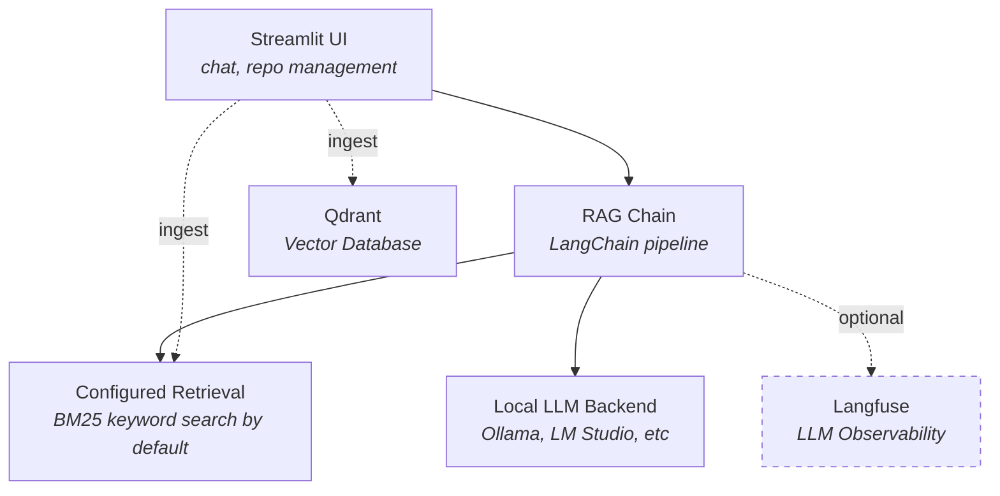

<p align="center">
  
</p>

<h1 align="center">Codebase RAG</h1>

<p align="center">
  <strong>Ask questions about any codebase. Runs entirely on your machine.</strong><br>
  Built with LangChain · Qdrant · Local LLMs · Streamlit
</p>

<p align="center">
  <a href="https://github.com/alexschiltmans/codebase-rag/actions/workflows/ci.yml"></a>
  <a href="pyproject.toml"></a>
  <a href="https://www.python.org/downloads/"></a>
  <a href="https://github.com/astral-sh/ruff"></a>
  <a href="LICENSE"></a>
</p>

## Why This Project?

- **Fully local.** Runs entirely on your machine. Your code never leaves your hardware.
- **BM25 retrieval by default.** The eval framework runs the same 42 scored questions through vector-only, BM25-only, and hybrid RRF retrieval rather than assuming hybrid would win. The three now find the expected source on 35 questions each, so recall no longer separates them, and the remaining metrics split: hybrid ranks the expected file first more often (26/42 against BM25's 21/42), while BM25 leads the two measures of whether the retrieved context carries the answer (context_recall 0.564 against 0.479, keyword recall 0.558 against 0.505). All five retrieved chunks go into one prompt, so content beats ordering here and BM25 stays the default. See the [retrieval stack findings](evals/retrieval-stack-findings.md).
- **Evaluated, not just vibes.** Ships with a reproducible evaluation framework; the current test set is 43 questions, 42 of them scored. See [retrieval stack findings](evals/retrieval-stack-findings.md) for the current embedder, candidate-depth and reranker measurements.
- **Observable.** Optional Langfuse integration traces every retrieval and generation step, so you can debug quality issues instead of guessing.
- **Documented decisions.** Architecture Decision Records explain *why* each technology was chosen, not just *what* was used. See the [ADR index](docs/adr-index.md).
- **Batteries included for the infrastructure.** `make services-start` gives you the vector DB and tracing dashboard with no configuration; `make app` starts the Streamlit app on the host. Inference is the one piece you choose: bring a native Ollama, any OpenAI-compatible server, or Docker Model Runner. A containerized Ollama is available too (`make services-start PROFILE=full`), but on macOS it runs on the CPU. [Getting Started](docs/getting-started.md) explains why that matters.

## Features

**Retrieval Design**
- **BM25 search, and one setting that changes it.** `RETRIEVER` decides what the Streamlit app, the CLI, and the HTTP API query with, and it defaults to `bm25`. Setting `RETRIEVER=hybrid` switches all three onto `HybridRetriever` (Reciprocal Rank Fusion, weighted 0.7/0.3); there is no per-surface default to keep in sync. `VectorRetriever` is not selectable, because the only measurement of it disables relevance filtering to isolate ranking quality and so describes a configuration you cannot run. The ingestion pipeline also runs a hybrid search as a post-ingest check, and the eval ablation scores all three.
- **Language-aware chunking.** Naively splitting code by token count breaks at arbitrary lines, destroying context. Python and Markdown/RST get structure-aware splitting; `.ipynb` notebooks get their own strategy that splits code cells as Python and markdown cells as Markdown; everything else uses generic recursive splitting.
- **Source citations.** Every answer includes the source files and repositories it drew from, so answers are verifiable.

**Infrastructure Choices**
- **Fully local stack.** A local inference backend of your choice (see [LLM Backends](#llm-backends)); Qdrant for vectors. No external API calls, no data egress.
- **Multi-repo ingestion.** Clone and index any public GitHub repository from the UI or CLI.
- **Idempotent ingestion.** Deterministic chunk IDs make re-ingestion safe and duplicate-free, so it's safe to run repeatedly in scheduled jobs or CI.

**Developer Experience**
- **Conversation memory.** Multi-turn conversations with persistent SQLite-backed chat history.
- **LLM observability.** Optional Langfuse integration for tracing retrieval and generation with per-span metrics.

## Architecture



**Data flow:**

1. **Ingest.** `GitLoader` clones a repo → `DocumentProcessor` splits files into chunks using language-specific strategies → chunks are embedded with `sentence-transformers/all-mpnet-base-v2` and stored in Qdrant, with a parallel BM25 index built for keyword search.
2. **Retrieve.** User query hits the configured retriever, BM25 unless `RETRIEVER` says otherwise, which returns the top-k matching documents.
3. **Generate.** Retrieved documents are formatted into a context prompt and sent to the configured LLM backend (Ollama, LM Studio, llama.cpp, vLLM, or Jan). The `RAGChain` handles conversation memory, prompt construction, and Langfuse tracing.
4. **Persist.** Chat history is stored in SQLite. Vector data lives in Qdrant. Both survive container restarts via Docker volumes.

## Project Structure

```
codebase-rag/
├── src/codebase_rag/
│   ├── app/              # Streamlit UI (main.py, runtime.py, state.py, ui_chat.py, ui_sidebar.py)
│   ├── config.py         # Environment-based configuration (singleton)
│   ├── data_ingestion/   # Git cloning, document processing, chunking
│   ├── database/         # Qdrant store, SQLite chat storage, embeddings
│   ├── llm/              # Local LLM backends (Ollama, OpenAI-compatible), RAG chain with Langfuse tracing
│   ├── retrieval/        # Vector search, BM25 search, hybrid retriever
│   └── services/         # Native folder picker
├── Makefile              # Development task runner (make help)
├── scripts/
│   └── ingest.py         # Repository ingestion pipeline (single and multi-repo)
├── docker/
│   ├── compose-dev.yml   # Full-stack Docker Compose
│   ├── Dockerfile        # App container (Python 3.12)
│   └── entrypoint.sh     # Auto-ingest + model pull on first boot
├── evals/                # Evaluation framework and results
├── tests/                # Unit, integration, e2e, performance tests
└── docs/                 # ADRs and design documentation
```

## Getting Started

Quick start: install [Ollama](https://ollama.com) natively and `ollama pull sam860/LFM2:350m`, run `make services-start` to bring up Qdrant and Langfuse, then `make app` → open http://localhost:8501. A native install is recommended because it reaches your GPU.

`make services-start PROFILE=full` containerizes everything including the LLM server, which is convenient for a disposable environment or CI, and should reach the GPU on Linux with the NVIDIA container runtime (not measured here). On macOS it does not: Docker Desktop's Linux VM has no Metal passthrough, so the same model measured 73 tok/s in the container against 380 tok/s natively. Those figures and the method behind them are in [the Model Runner investigation](docs/docker-model-runner-findings.md). The app's sidebar reports which endpoint answered and whether the model is on the GPU, so you can always check.

The default model is small enough to run on any machine, and answers accordingly; set `LLM_MODEL_NAME` (env or compose) to a larger Ollama model for better answers. See [docs/deprecated/evaluation-results.md](docs/deprecated/evaluation-results.md) for the numbers behind that tradeoff, noting they are not reproducible against the current corpus.

See the [setup guide](docs/getting-started.md) for Docker and local installation, repository ingestion, and example queries.

## Configuration

All settings are configured via environment variables or `.env`. See the full [configuration reference](docs/configuration.md).

### LLM Backends

By default, the app uses Ollama for inference. To use a different backend, set `LLM_PROVIDER`:

**Ollama** (default)
```bash
LLM_PROVIDER=ollama
OLLAMA_BASE_URL=http://127.0.0.1:11434
```

Docker Model Runner, LM Studio, llama.cpp server, vLLM, and Jan are also supported. See the [configuration reference](docs/configuration.md) for the settings each one needs.

## Command-Line Interface

Use `codebase-rag` to query and explore codebases from shell scripts, git hooks, and CI pipelines. All output goes to stdout (clean for piping), while diagnostics go to stderr.

Only warnings and errors are logged by default. Add `-v` to see the per-stage progress lines
(index load, retrieval, timings) on stderr, or `-vv` for debug detail:

```bash
codebase-rag -v ask "explain the ingestion pipeline"
```

### Query Command

Search for code snippets:

```bash
codebase-rag query "where is error handling implemented?"
```

Output in compact format, one numbered block per result (file, score, repo-relative path, snippet):

```
[1] handlers.py  (0.950)
    my-repo/src/app/handlers.py
────────────────────────────────
def handle_error(error):
    logger.error("Error occurred: %s", error)
    return {"status": "error", "message": str(error)}
```

`--format json` keeps the full absolute path for scripts.

Output as JSON for programmatic use:

```bash
codebase-rag query "retry logic" --format json | jq '.[] | .path'
```

Limit results and filter by repository:

```bash
codebase-rag query "database query" --k 3 --repo my-repo
```

### Ask Command

Get a full natural-language answer grounded in the codebase:

```bash
codebase-rag ask "explain the ingestion pipeline"
```

### Piping into LLM CLIs

Compose codebase retrieval with other tools. Example with `claude-cli`:

```bash
codebase-rag query "where is authentication?" | claude "Explain this code and suggest security improvements"
```

### Using in Shell Scripts and Hooks

Pre-commit hook that checks for debugging statements:

```bash
codebase-rag query "debugger" --format compact | grep -q pdb && echo "Debugger found!"
```

Git hook to add context to commit messages. Exit code 2 means "no results", not
a failure, so a `set -e` hook has to tolerate it explicitly or it aborts the
commit on the common case of a query that legitimately matches nothing:

```bash
context=$(codebase-rag query "$(cat /tmp/commit-msg)" --k 2 --format compact) || [ $? -eq 2 ]
if [ -n "$context" ]; then
    echo -e "\nContext:\n$context" >> /tmp/commit-msg
fi
```

## HTTP API

`make api` starts a FastAPI server (`uvicorn`) alongside Streamlit, giving coding agents (Copilot, Claude Code, OpenCode, Cursor, aider) direct, token-budgeted access to the retrieval stack instead of falling back to grep/whole-file reads. It binds to `127.0.0.1` by default (`API_HOST`/`API_PORT`). **Exposing it beyond localhost requires adding authentication first; there is none today.**

- `POST /search`, `{"query": str, "k": int, "repo": str | null, "token_budget": int, "format": "json" | "compact"}`. Ranks chunks with the configured retriever (BM25 by default; `RETRIEVER=hybrid` switches this and every other surface together), drops overlapping chunks from the same file, and stops once the combined token estimate would exceed `token_budget` (default 2000). Each result has `path`, `start_line`, `end_line`, `score`, `snippet`, `token_estimate`. `format=compact` returns plain text (`path:start-end (score)` + snippet) instead of a JSON envelope.
- `POST /answer`, `{"question": str, "stream": bool}`. Runs the full RAG chain and returns `answer` plus `sources` (file path + line range). `stream: true` returns Server-Sent Events (`event: token`, then a final `event: done` carrying `sources`).
- `GET /repos`, ingested repositories with freshness metadata (last-ingest time, and the indexed HEAD SHA for git-backed repos).
- `POST /ingest`, `{"source": str}`, accepting a git URL or a local filesystem path. Local paths are ingested from the working tree in place, without cloning. Re-ingesting diffs files by content hash so only changed files re-embed; unchanged chunks are left untouched. Returns a job status immediately (`202`); a second ingest while one is running gets `409`. Poll `GET /ingest/status` for completion.

## Development

The `Makefile` is the primary development interface. Run `make help` for the full list.

## License

This project is licensed under MIT. See the [LICENSE](LICENSE) file for details.
